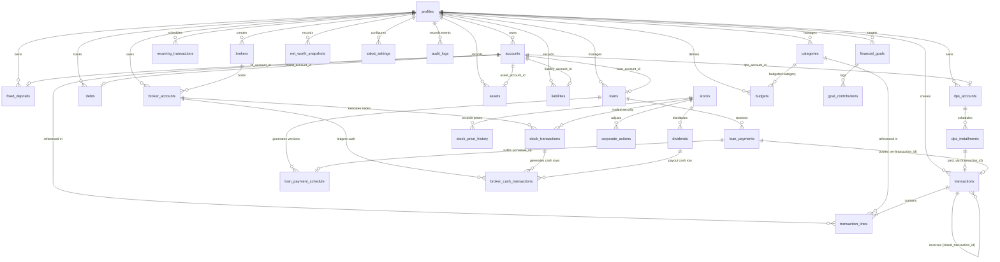

# 🗄️ ERD.md — Entity-Relationship Diagram & Relational Schema

> **Status:** LOCKED — Phase 0 Relational Specification  
> **Database:** PostgreSQL (Supabase Compatible)  
> **Numeric Guarantee:** Exact `NUMERIC(14,2)` for monetary values, `NUMERIC(18,6)` for stock quantities and unit prices  
> **Row Level Security:** Tenant isolation enforced via `user_id = auth.uid()` on all user-owned tables

---

## 1. High-Level Entity-Relationship Diagram



---

## 2. Table Schemas & Foreign Keys

### 2.1 Core Identity & Ledger

```sql
-- 1. Profiles Table
CREATE TABLE profiles (
    id UUID PRIMARY KEY REFERENCES auth.users(id) ON DELETE CASCADE,
    full_name VARCHAR(128) NOT NULL,
    base_currency VARCHAR(3) NOT NULL DEFAULT 'BDT',
    timezone VARCHAR(64) NOT NULL DEFAULT 'Asia/Dhaka',
    created_at TIMESTAMPTZ NOT NULL DEFAULT NOW(),
    updated_at TIMESTAMPTZ NOT NULL DEFAULT NOW()
);

-- 2. Accounts Table
CREATE TABLE accounts (
    id UUID PRIMARY KEY DEFAULT gen_random_uuid(),
    user_id UUID NOT NULL REFERENCES profiles(id) ON DELETE CASCADE,
    name VARCHAR(128) NOT NULL,
    account_type VARCHAR(32) NOT NULL CHECK (
        account_type IN (
            'cash', 'bank', 'mobile_wallet', 'credit_card',
            'fd', 'dps', 'receivable', 'payable', 'loan',
            'asset', 'liability'
        )
    ),
    currency VARCHAR(3) NOT NULL DEFAULT 'BDT',
    institution_name VARCHAR(128),
    account_number_mask VARCHAR(32),
    credit_limit NUMERIC(14,2),
    is_zakatable BOOLEAN NOT NULL DEFAULT true,
    is_archived BOOLEAN NOT NULL DEFAULT false,
    created_at TIMESTAMPTZ NOT NULL DEFAULT NOW(),
    updated_at TIMESTAMPTZ NOT NULL DEFAULT NOW(),
    deleted_at TIMESTAMPTZ
);

-- 3. Categories Table
CREATE TABLE categories (
    id UUID PRIMARY KEY DEFAULT gen_random_uuid(),
    user_id UUID NOT NULL REFERENCES profiles(id) ON DELETE CASCADE,
    name VARCHAR(64) NOT NULL,
    type VARCHAR(16) NOT NULL CHECK (type IN ('income', 'expense')),
    icon VARCHAR(64),
    color VARCHAR(32),
    parent_category_id UUID REFERENCES categories(id) ON DELETE SET NULL,
    is_system BOOLEAN NOT NULL DEFAULT false,
    created_at TIMESTAMPTZ NOT NULL DEFAULT NOW(),
    updated_at TIMESTAMPTZ NOT NULL DEFAULT NOW(),
    deleted_at TIMESTAMPTZ
);

-- 4. Transactions Table (Event Header)
CREATE TABLE transactions (
    id UUID PRIMARY KEY DEFAULT gen_random_uuid(),
    user_id UUID NOT NULL REFERENCES profiles(id) ON DELETE CASCADE,
    date DATE NOT NULL,
    type VARCHAR(32) NOT NULL CHECK (
        type IN (
            'expense', 'income', 'transfer', 'split_expense',
            'cc_purchase', 'cc_payment', 'loan_disbursement', 'loan_emi',
            'fd_open', 'fd_maturity', 'dps_installment', 'dps_maturity',
            'broker_funding', 'broker_withdrawal', 'person_lend', 'person_borrow',
            'asset_purchase', 'opening_balance', 'adjustment'
        )
    ),
    status VARCHAR(16) NOT NULL DEFAULT 'posted' CHECK (status IN ('draft', 'posted', 'voided')),
    version INTEGER NOT NULL DEFAULT 1,
    note TEXT,
    linked_transaction_id UUID REFERENCES transactions(id) ON DELETE RESTRICT,
    created_by UUID NOT NULL REFERENCES profiles(id) ON DELETE CASCADE,
    created_at TIMESTAMPTZ NOT NULL DEFAULT NOW(),
    updated_at TIMESTAMPTZ NOT NULL DEFAULT NOW()
);

-- 5. Transaction Lines Table (Atomic Double-Entry Lines)
CREATE TABLE transaction_lines (
    id UUID PRIMARY KEY DEFAULT gen_random_uuid(),
    transaction_id UUID NOT NULL REFERENCES transactions(id) ON DELETE CASCADE,
    line_type VARCHAR(16) NOT NULL CHECK (line_type IN ('account', 'category')),
    account_id UUID REFERENCES accounts(id) ON DELETE RESTRICT,
    category_id UUID REFERENCES categories(id) ON DELETE RESTRICT,
    amount NUMERIC(14,2) NOT NULL,
    memo TEXT,
    created_at TIMESTAMPTZ NOT NULL DEFAULT NOW(),
    CONSTRAINT chk_line_type_exclusivity CHECK (
        (line_type = 'account' AND account_id IS NOT NULL AND category_id IS NULL) OR
        (line_type = 'category' AND category_id IS NOT NULL AND account_id IS NULL)
    )
);
```

---

### 2.2 Sub-Ledgers: FD, DPS, Debts, Loans & Assets

```sql
-- 6. Fixed Deposits
CREATE TABLE fixed_deposits (
    id UUID PRIMARY KEY DEFAULT gen_random_uuid(),
    user_id UUID NOT NULL REFERENCES profiles(id) ON DELETE CASCADE,
    fd_account_id UUID NOT NULL UNIQUE REFERENCES accounts(id) ON DELETE RESTRICT,
    source_account_id UUID NOT NULL REFERENCES accounts(id) ON DELETE RESTRICT,
    institution_name VARCHAR(128) NOT NULL,
    fd_number VARCHAR(64),
    principal_amount NUMERIC(14,2) NOT NULL CHECK (principal_amount > 0),
    interest_rate NUMERIC(5,2) NOT NULL,
    tenure_months INTEGER NOT NULL,
    start_date DATE NOT NULL,
    maturity_date DATE NOT NULL,
    compounding_frequency VARCHAR(16) NOT NULL DEFAULT 'annually' CHECK (
        compounding_frequency IN ('monthly', 'quarterly', 'half_yearly', 'annually')
    ),
    expected_maturity_amount NUMERIC(14,2) NOT NULL,
    tax_rate NUMERIC(5,2) NOT NULL DEFAULT 10.00,
    status VARCHAR(16) NOT NULL DEFAULT 'active' CHECK (status IN ('active', 'matured', 'broken')),
    created_at TIMESTAMPTZ NOT NULL DEFAULT NOW(),
    updated_at TIMESTAMPTZ NOT NULL DEFAULT NOW()
);

-- 7. DPS Accounts
CREATE TABLE dps_accounts (
    id UUID PRIMARY KEY DEFAULT gen_random_uuid(),
    user_id UUID NOT NULL REFERENCES profiles(id) ON DELETE CASCADE,
    dps_account_id UUID NOT NULL UNIQUE REFERENCES accounts(id) ON DELETE RESTRICT,
    source_account_id UUID NOT NULL REFERENCES accounts(id) ON DELETE RESTRICT,
    institution_name VARCHAR(128) NOT NULL,
    dps_number VARCHAR(64),
    monthly_installment NUMERIC(14,2) NOT NULL CHECK (monthly_installment > 0),
    tenure_months INTEGER NOT NULL,
    interest_rate NUMERIC(5,2) NOT NULL,
    interest_calculation_method VARCHAR(32) NOT NULL DEFAULT 'compound_monthly',
    tax_rate NUMERIC(5,2) NOT NULL DEFAULT 10.00,
    gross_interest NUMERIC(14,2) NOT NULL DEFAULT 0.00,
    net_interest NUMERIC(14,2) NOT NULL DEFAULT 0.00,
    start_date DATE NOT NULL,
    maturity_date DATE NOT NULL,
    status VARCHAR(16) NOT NULL DEFAULT 'active' CHECK (status IN ('active', 'matured', 'closed')),
    created_at TIMESTAMPTZ NOT NULL DEFAULT NOW(),
    updated_at TIMESTAMPTZ NOT NULL DEFAULT NOW()
);

-- 8. DPS Installments
CREATE TABLE dps_installments (
    id UUID PRIMARY KEY DEFAULT gen_random_uuid(),
    dps_account_id UUID NOT NULL REFERENCES dps_accounts(id) ON DELETE CASCADE,
    installment_number INTEGER NOT NULL,
    due_date DATE NOT NULL,
    expected_amount NUMERIC(14,2) NOT NULL,
    paid_amount NUMERIC(14,2),
    paid_date DATE,
    status VARCHAR(16) NOT NULL DEFAULT 'pending' CHECK (status IN ('pending', 'paid', 'missed')),
    transaction_id UUID UNIQUE REFERENCES transactions(id) ON DELETE SET NULL,
    created_at TIMESTAMPTZ NOT NULL DEFAULT NOW(),
    UNIQUE (dps_account_id, installment_number)
);

-- 9. Debts (Person to Person)
CREATE TABLE debts (
    id UUID PRIMARY KEY DEFAULT gen_random_uuid(),
    user_id UUID NOT NULL REFERENCES profiles(id) ON DELETE CASCADE,
    linked_account_id UUID NOT NULL UNIQUE REFERENCES accounts(id) ON DELETE RESTRICT,
    person_name VARCHAR(128) NOT NULL,
    contact_phone VARCHAR(32),
    direction VARCHAR(16) NOT NULL CHECK (direction IN ('borrowed', 'lent')),
    initial_amount NUMERIC(14,2) NOT NULL CHECK (initial_amount > 0),
    due_date DATE,
    status VARCHAR(16) NOT NULL DEFAULT 'active' CHECK (status IN ('active', 'settled', 'defaulted')),
    notes TEXT,
    created_at TIMESTAMPTZ NOT NULL DEFAULT NOW(),
    updated_at TIMESTAMPTZ NOT NULL DEFAULT NOW()
);

-- 10. Bank Loans
CREATE TABLE loans (
    id UUID PRIMARY KEY DEFAULT gen_random_uuid(),
    user_id UUID NOT NULL REFERENCES profiles(id) ON DELETE CASCADE,
    loan_account_id UUID NOT NULL UNIQUE REFERENCES accounts(id) ON DELETE RESTRICT,
    disbursement_account_id UUID NOT NULL REFERENCES accounts(id) ON DELETE RESTRICT,
    institution_name VARCHAR(128) NOT NULL,
    loan_type VARCHAR(32) NOT NULL CHECK (loan_type IN ('home', 'auto', 'personal', 'overdraft', 'business')),
    interest_method VARCHAR(16) NOT NULL CHECK (interest_method IN ('reducing', 'flat')),
    rate_type VARCHAR(16) NOT NULL CHECK (rate_type IN ('fixed', 'variable')),
    principal NUMERIC(14,2) NOT NULL CHECK (principal > 0),
    annual_interest_rate NUMERIC(5,2) NOT NULL,
    tenure_months INTEGER NOT NULL,
    emi_amount NUMERIC(14,2) NOT NULL,
    disbursement_date DATE NOT NULL,
    status VARCHAR(16) NOT NULL DEFAULT 'active' CHECK (status IN ('active', 'paid_off', 'restructured')),
    created_at TIMESTAMPTZ NOT NULL DEFAULT NOW(),
    updated_at TIMESTAMPTZ NOT NULL DEFAULT NOW()
);

-- 11. Loan Payment Schedule (Versioned Amortization)
CREATE TABLE loan_payment_schedule (
    id UUID PRIMARY KEY DEFAULT gen_random_uuid(),
    loan_id UUID NOT NULL REFERENCES loans(id) ON DELETE CASCADE,
    version INTEGER NOT NULL DEFAULT 1,
    installment_number INTEGER NOT NULL,
    due_date DATE NOT NULL,
    scheduled_principal NUMERIC(14,2) NOT NULL,
    scheduled_interest NUMERIC(14,2) NOT NULL,
    scheduled_emi_amount NUMERIC(14,2) NOT NULL,
    remaining_principal_after NUMERIC(14,2) NOT NULL,
    status VARCHAR(16) NOT NULL DEFAULT 'pending' CHECK (status IN ('pending', 'paid', 'missed', 'waived')),
    created_at TIMESTAMPTZ NOT NULL DEFAULT NOW(),
    UNIQUE (loan_id, version, installment_number)
);

-- 12. Loan Payments
CREATE TABLE loan_payments (
    id UUID PRIMARY KEY DEFAULT gen_random_uuid(),
    loan_id UUID NOT NULL REFERENCES loans(id) ON DELETE CASCADE,
    schedule_id UUID REFERENCES loan_payment_schedule(id) ON DELETE SET NULL,
    transaction_id UUID NOT NULL UNIQUE REFERENCES transactions(id) ON DELETE CASCADE,
    principal_portion NUMERIC(14,2) NOT NULL,
    interest_portion NUMERIC(14,2) NOT NULL,
    payment_date DATE NOT NULL,
    created_at TIMESTAMPTZ NOT NULL DEFAULT NOW()
);

-- 13. Physical Assets Metadata
CREATE TABLE assets (
    id UUID PRIMARY KEY DEFAULT gen_random_uuid(),
    user_id UUID NOT NULL REFERENCES profiles(id) ON DELETE CASCADE,
    asset_account_id UUID NOT NULL UNIQUE REFERENCES accounts(id) ON DELETE RESTRICT,
    asset_name VARCHAR(128) NOT NULL,
    asset_category VARCHAR(32) NOT NULL CHECK (asset_category IN ('real_estate', 'vehicle', 'gold_jewelry', 'electronics', 'other')),
    purchase_date DATE NOT NULL,
    purchase_price NUMERIC(14,2) NOT NULL,
    description TEXT,
    created_at TIMESTAMPTZ NOT NULL DEFAULT NOW(),
    updated_at TIMESTAMPTZ NOT NULL DEFAULT NOW()
);

-- 14. Static Liabilities Metadata
CREATE TABLE liabilities (
    id UUID PRIMARY KEY DEFAULT gen_random_uuid(),
    user_id UUID NOT NULL REFERENCES profiles(id) ON DELETE CASCADE,
    liability_account_id UUID NOT NULL UNIQUE REFERENCES accounts(id) ON DELETE RESTRICT,
    liability_name VARCHAR(128) NOT NULL,
    liability_type VARCHAR(32) NOT NULL,
    created_at TIMESTAMPTZ NOT NULL DEFAULT NOW(),
    updated_at TIMESTAMPTZ NOT NULL DEFAULT NOW()
);
```

---

### 2.3 Stock Brokerage, Securities & Market Data

```sql
-- 15. Brokers
CREATE TABLE brokers (
    id UUID PRIMARY KEY DEFAULT gen_random_uuid(),
    user_id UUID NOT NULL REFERENCES profiles(id) ON DELETE CASCADE,
    name VARCHAR(128) NOT NULL,
    license_number VARCHAR(64),
    created_at TIMESTAMPTZ NOT NULL DEFAULT NOW()
);

-- 16. Broker Accounts (BO Accounts)
CREATE TABLE broker_accounts (
    id UUID PRIMARY KEY DEFAULT gen_random_uuid(),
    user_id UUID NOT NULL REFERENCES profiles(id) ON DELETE CASCADE,
    broker_id UUID NOT NULL REFERENCES brokers(id) ON DELETE CASCADE,
    bo_id VARCHAR(32) NOT NULL,
    account_name VARCHAR(64) NOT NULL,
    is_default BOOLEAN NOT NULL DEFAULT false,
    created_at TIMESTAMPTZ NOT NULL DEFAULT NOW(),
    UNIQUE (user_id, bo_id)
);

-- 17. Broker Cash Transactions (Authoritative Cash Sub-Ledger)
CREATE TABLE broker_cash_transactions (
    id UUID PRIMARY KEY DEFAULT gen_random_uuid(),
    user_id UUID NOT NULL REFERENCES profiles(id) ON DELETE CASCADE,
    broker_account_id UUID NOT NULL REFERENCES broker_accounts(id) ON DELETE CASCADE,
    transaction_date DATE NOT NULL,
    type VARCHAR(32) NOT NULL CHECK (
        type IN (
            'deposit', 'withdrawal', 'buy_gross', 'sell_gross',
            'commission', 'tax', 'other_charge', 'dividend', 'adjustment'
        )
    ),
    amount_signed NUMERIC(14,2) NOT NULL,
    source_event_key VARCHAR(128) UNIQUE,
    linked_stock_transaction_id UUID,
    note TEXT,
    created_at TIMESTAMPTZ NOT NULL DEFAULT NOW()
);

-- 18. Stocks Master Table
CREATE TABLE stocks (
    id UUID PRIMARY KEY DEFAULT gen_random_uuid(),
    symbol VARCHAR(32) NOT NULL UNIQUE,
    company_name VARCHAR(128) NOT NULL,
    sector VARCHAR(64) NOT NULL,
    exchange VARCHAR(16) NOT NULL DEFAULT 'DSE' CHECK (exchange IN ('DSE', 'CSE')),
    is_active BOOLEAN NOT NULL DEFAULT true,
    created_at TIMESTAMPTZ NOT NULL DEFAULT NOW()
);

-- 19. Stock Transactions
CREATE TABLE stock_transactions (
    id UUID PRIMARY KEY DEFAULT gen_random_uuid(),
    user_id UUID NOT NULL REFERENCES profiles(id) ON DELETE CASCADE,
    broker_account_id UUID NOT NULL REFERENCES broker_accounts(id) ON DELETE CASCADE,
    stock_id UUID NOT NULL REFERENCES stocks(id) ON DELETE RESTRICT,
    trade_date DATE NOT NULL,
    settlement_date DATE NOT NULL,
    transaction_type VARCHAR(8) NOT NULL CHECK (transaction_type IN ('buy', 'sell')),
    quantity NUMERIC(14,2) NOT NULL CHECK (quantity > 0),
    price NUMERIC(14,4) NOT NULL CHECK (price > 0),
    gross_value NUMERIC(14,2) NOT NULL,
    commission NUMERIC(14,2) NOT NULL DEFAULT 0.00,
    tax NUMERIC(14,2) NOT NULL DEFAULT 0.00,
    other_charges NUMERIC(14,2) NOT NULL DEFAULT 0.00,
    net_value NUMERIC(14,2) NOT NULL,
    reference VARCHAR(64),
    created_at TIMESTAMPTZ NOT NULL DEFAULT NOW()
);

-- 20. Dividends
CREATE TABLE dividends (
    id UUID PRIMARY KEY DEFAULT gen_random_uuid(),
    user_id UUID NOT NULL REFERENCES profiles(id) ON DELETE CASCADE,
    broker_account_id UUID NOT NULL REFERENCES broker_accounts(id) ON DELETE CASCADE,
    stock_id UUID NOT NULL REFERENCES stocks(id) ON DELETE RESTRICT,
    declaration_date DATE,
    record_date DATE NOT NULL,
    payment_date DATE NOT NULL,
    shares NUMERIC(14,2) NOT NULL,
    dividend_per_share NUMERIC(10,4) NOT NULL,
    gross_dividend NUMERIC(14,2) NOT NULL,
    tax NUMERIC(14,2) NOT NULL DEFAULT 0.00,
    net_dividend NUMERIC(14,2) NOT NULL,
    is_external_payout BOOLEAN NOT NULL DEFAULT false,
    created_at TIMESTAMPTZ NOT NULL DEFAULT NOW()
);

-- 21. Corporate Actions
CREATE TABLE corporate_actions (
    id UUID PRIMARY KEY DEFAULT gen_random_uuid(),
    user_id UUID NOT NULL REFERENCES profiles(id) ON DELETE CASCADE,
    stock_id UUID NOT NULL REFERENCES stocks(id) ON DELETE RESTRICT,
    type VARCHAR(32) NOT NULL CHECK (type IN ('bonus', 'split', 'right', 'merger', 'consolidation')),
    announcement_date DATE NOT NULL,
    effective_date DATE NOT NULL,
    ratio VARCHAR(32) NOT NULL,
    eligible_quantity NUMERIC(14,2) NOT NULL,
    new_quantity NUMERIC(14,2) NOT NULL,
    cash_component NUMERIC(14,2) NOT NULL DEFAULT 0.00,
    new_cost_basis NUMERIC(14,4) NOT NULL,
    notes TEXT,
    created_at TIMESTAMPTZ NOT NULL DEFAULT NOW()
);

-- 22. Stock Price History
CREATE TABLE stock_price_history (
    id UUID PRIMARY KEY DEFAULT gen_random_uuid(),
    stock_id UUID NOT NULL REFERENCES stocks(id) ON DELETE CASCADE,
    price_date DATE NOT NULL,
    close_price NUMERIC(14,4) NOT NULL,
    source VARCHAR(32) NOT NULL DEFAULT 'DSE_FEED',
    created_at TIMESTAMPTZ NOT NULL DEFAULT NOW(),
    UNIQUE (stock_id, price_date, source)
);

-- 23. Benchmark Index Prices (e.g. DSEX)
CREATE TABLE benchmark_index_prices (
    id UUID PRIMARY KEY DEFAULT gen_random_uuid(),
    index_symbol VARCHAR(32) NOT NULL,
    price_date DATE NOT NULL,
    close_value NUMERIC(14,4) NOT NULL,
    created_at TIMESTAMPTZ NOT NULL DEFAULT NOW(),
    UNIQUE (index_symbol, price_date)
);

-- 24. Portfolio Snapshots
CREATE TABLE portfolio_snapshots (
    id UUID PRIMARY KEY DEFAULT gen_random_uuid(),
    user_id UUID NOT NULL REFERENCES profiles(id) ON DELETE CASCADE,
    snapshot_date DATE NOT NULL,
    total_invested NUMERIC(14,2) NOT NULL,
    current_market_value NUMERIC(14,2) NOT NULL,
    broker_cash_balance NUMERIC(14,2) NOT NULL,
    unrealized_pl NUMERIC(14,2) NOT NULL,
    daily_twr NUMERIC(10,6),
    cumulative_twr NUMERIC(10,6),
    created_at TIMESTAMPTZ NOT NULL DEFAULT NOW(),
    UNIQUE (user_id, snapshot_date)
);
```

---

### 2.4 Budgets, Goals, Snapshots & Utilities

```sql
-- 25. Budgets
CREATE TABLE budgets (
    id UUID PRIMARY KEY DEFAULT gen_random_uuid(),
    user_id UUID NOT NULL REFERENCES profiles(id) ON DELETE CASCADE,
    category_id UUID NOT NULL REFERENCES categories(id) ON DELETE CASCADE,
    month_year VARCHAR(7) NOT NULL, -- 'YYYY-MM'
    allocated_amount NUMERIC(14,2) NOT NULL CHECK (allocated_amount >= 0),
    warning_threshold_pct NUMERIC(5,2) NOT NULL DEFAULT 90.00,
    created_at TIMESTAMPTZ NOT NULL DEFAULT NOW(),
    UNIQUE (user_id, category_id, month_year)
);

-- 26. Recurring Transactions
CREATE TABLE recurring_transactions (
    id UUID PRIMARY KEY DEFAULT gen_random_uuid(),
    user_id UUID NOT NULL REFERENCES profiles(id) ON DELETE CASCADE,
    template_transaction JSONB NOT NULL,
    frequency VARCHAR(16) NOT NULL CHECK (frequency IN ('daily', 'weekly', 'monthly', 'quarterly', 'yearly')),
    start_date DATE NOT NULL,
    end_date DATE,
    next_run DATE NOT NULL,
    last_run DATE,
    is_paused BOOLEAN NOT NULL DEFAULT false,
    auto_post BOOLEAN NOT NULL DEFAULT true,
    created_at TIMESTAMPTZ NOT NULL DEFAULT NOW()
);

-- 27. Financial Goals
CREATE TABLE financial_goals (
    id UUID PRIMARY KEY DEFAULT gen_random_uuid(),
    user_id UUID NOT NULL REFERENCES profiles(id) ON DELETE CASCADE,
    name VARCHAR(128) NOT NULL,
    target_amount NUMERIC(14,2) NOT NULL CHECK (target_amount > 0),
    target_date DATE NOT NULL,
    goal_mode VARCHAR(32) NOT NULL CHECK (goal_mode IN ('tracking_goal', 'linked_savings_account_goal')),
    linked_account_id UUID REFERENCES accounts(id) ON DELETE SET NULL,
    status VARCHAR(16) NOT NULL DEFAULT 'in_progress' CHECK (status IN ('in_progress', 'achieved', 'cancelled')),
    created_at TIMESTAMPTZ NOT NULL DEFAULT NOW()
);

-- 28. Goal Contributions
CREATE TABLE goal_contributions (
    id UUID PRIMARY KEY DEFAULT gen_random_uuid(),
    goal_id UUID NOT NULL REFERENCES financial_goals(id) ON DELETE CASCADE,
    amount NUMERIC(14,2) NOT NULL CHECK (amount > 0),
    contribution_date DATE NOT NULL,
    note TEXT,
    created_at TIMESTAMPTZ NOT NULL DEFAULT NOW()
);

-- 29. Net Worth Snapshots
CREATE TABLE net_worth_snapshots (
    id UUID PRIMARY KEY DEFAULT gen_random_uuid(),
    user_id UUID NOT NULL REFERENCES profiles(id) ON DELETE CASCADE,
    snapshot_date DATE NOT NULL,
    total_assets NUMERIC(14,2) NOT NULL,
    total_liabilities NUMERIC(14,2) NOT NULL,
    net_worth NUMERIC(14,2) NOT NULL,
    created_at TIMESTAMPTZ NOT NULL DEFAULT NOW(),
    UNIQUE (user_id, snapshot_date)
);

-- 30. Zakat Settings
CREATE TABLE zakat_settings (
    id UUID PRIMARY KEY DEFAULT gen_random_uuid(),
    user_id UUID NOT NULL UNIQUE REFERENCES profiles(id) ON DELETE CASCADE,
    nisab_basis VARCHAR(16) NOT NULL DEFAULT 'silver' CHECK (nisab_basis IN ('gold', 'silver')),
    valuation_method VARCHAR(16) NOT NULL DEFAULT 'market_price',
    zakat_rate NUMERIC(5,3) NOT NULL DEFAULT 2.500,
    liability_deduction_rule VARCHAR(32) NOT NULL DEFAULT 'immediate_short_term',
    created_at TIMESTAMPTZ NOT NULL DEFAULT NOW()
);

-- 31. Audit Logs (INSERT-ONLY)
CREATE TABLE audit_logs (
    id UUID PRIMARY KEY DEFAULT gen_random_uuid(),
    user_id UUID NOT NULL REFERENCES profiles(id) ON DELETE CASCADE,
    action VARCHAR(64) NOT NULL,
    entity_table VARCHAR(64) NOT NULL,
    entity_id UUID NOT NULL,
    payload JSONB NOT NULL,
    ip_address VARCHAR(45),
    created_at TIMESTAMPTZ NOT NULL DEFAULT NOW()
);
```

---

## 3. Authoritative Core Database Views

```sql
-- View 1: Authoritative Account Balances
CREATE OR REPLACE VIEW v_account_balances AS
SELECT 
    a.id AS account_id,
    a.user_id,
    a.name AS account_name,
    a.account_type,
    a.currency,
    COALESCE(SUM(tl.amount), 0.00)::NUMERIC(14,2) AS current_balance
FROM accounts a
LEFT JOIN transaction_lines tl ON a.id = tl.account_id AND tl.line_type = 'account'
LEFT JOIN transactions t ON tl.transaction_id = t.id AND t.status = 'posted'
WHERE a.deleted_at IS NULL
GROUP BY a.id, a.user_id, a.name, a.account_type, a.currency;

-- View 2: Authoritative Broker Cash Balances
CREATE OR REPLACE VIEW v_broker_cash_balance AS
SELECT 
    ba.id AS broker_account_id,
    ba.user_id,
    ba.bo_id,
    COALESCE(SUM(bct.amount_signed), 0.00)::NUMERIC(14,2) AS cash_balance
FROM broker_accounts ba
LEFT JOIN broker_cash_transactions bct ON ba.id = bct.broker_account_id
GROUP BY ba.id, ba.user_id, ba.bo_id;

-- View 3: Authoritative Stock Holdings (Weighted Average Cost Basis)
CREATE OR REPLACE VIEW v_stock_holdings AS
WITH trade_sums AS (
    SELECT 
        st.user_id,
        st.broker_account_id,
        st.stock_id,
        SUM(CASE WHEN st.transaction_type = 'buy' THEN st.quantity ELSE -st.quantity END) AS remaining_shares,
        SUM(CASE WHEN st.transaction_type = 'buy' THEN (st.gross_value + st.commission + st.tax + st.other_charges) ELSE 0 END) AS total_buy_cost_basis,
        SUM(CASE WHEN st.transaction_type = 'buy' THEN st.quantity ELSE 0 END) AS total_bought_shares
    FROM stock_transactions st
    GROUP BY st.user_id, st.broker_account_id, st.stock_id
),
latest_price AS (
    SELECT DISTINCT ON (stock_id) stock_id, close_price, price_date
    FROM stock_price_history
    ORDER BY stock_id, price_date DESC
)
SELECT 
    ts.user_id,
    ts.broker_account_id,
    ts.stock_id,
    s.symbol,
    s.company_name,
    s.sector,
    ts.remaining_shares::NUMERIC(14,2) AS quantity,
    CASE 
        WHEN ts.total_bought_shares > 0 THEN (ts.total_buy_cost_basis / ts.total_bought_shares)::NUMERIC(14,4)
        ELSE 0.00
    END AS weighted_average_cost,
    COALESCE(lp.close_price, 0.00)::NUMERIC(14,4) AS current_market_price,
    (ts.remaining_shares * CASE WHEN ts.total_bought_shares > 0 THEN (ts.total_buy_cost_basis / ts.total_bought_shares) ELSE 0 END)::NUMERIC(14,2) AS invested_value,
    (ts.remaining_shares * COALESCE(lp.close_price, 0.00))::NUMERIC(14,2) AS current_market_value,
    ((ts.remaining_shares * COALESCE(lp.close_price, 0.00)) - (ts.remaining_shares * CASE WHEN ts.total_bought_shares > 0 THEN (ts.total_buy_cost_basis / ts.total_bought_shares) ELSE 0 END))::NUMERIC(14,2) AS unrealized_pl
FROM trade_sums ts
JOIN stocks s ON ts.stock_id = s.id
LEFT JOIN latest_price lp ON ts.stock_id = lp.stock_id
WHERE ts.remaining_shares > 0;

-- View 4: Authoritative Real-Time Net Worth
CREATE OR REPLACE VIEW v_net_worth AS
WITH account_sum AS (
    SELECT user_id, COALESCE(SUM(current_balance), 0.00) AS total_account_balance
    FROM v_account_balances
    GROUP BY user_id
),
broker_cash_sum AS (
    SELECT user_id, COALESCE(SUM(cash_balance), 0.00) AS total_broker_cash
    FROM v_broker_cash_balance
    GROUP BY user_id
),
stock_mv_sum AS (
    SELECT user_id, COALESCE(SUM(current_market_value), 0.00) AS total_stock_market_value
    FROM v_stock_holdings
    GROUP BY user_id
)
SELECT 
    p.id AS user_id,
    COALESCE(acc.total_account_balance, 0.00) AS accounts_balance,
    COALESCE(bc.total_broker_cash, 0.00) AS broker_cash,
    COALESCE(smv.total_stock_market_value, 0.00) AS stock_market_value,
    (
        COALESCE(acc.total_account_balance, 0.00) + 
        COALESCE(bc.total_broker_cash, 0.00) + 
        COALESCE(smv.total_stock_market_value, 0.00)
    )::NUMERIC(14,2) AS net_worth
FROM profiles p
LEFT JOIN account_sum acc ON p.id = acc.user_id
LEFT JOIN broker_cash_sum bc ON p.id = bc.user_id
LEFT JOIN stock_mv_sum smv ON p.id = smv.user_id;
```
